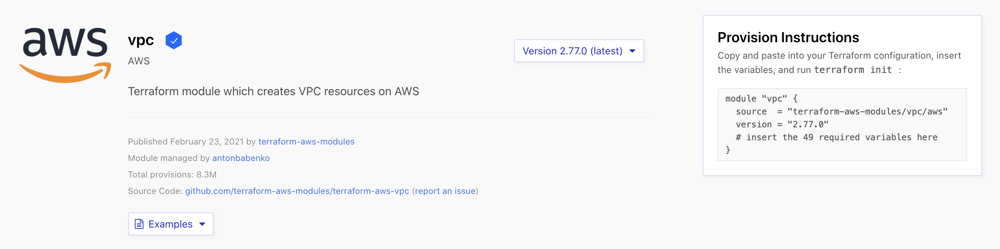

# terraform-aws-ecs

Terraform configuration for provisioning a trivial AWS ECS example. **Note** the intro material for the first sections below is cut/paste/modified from [learn terraform modules overview](https://learn.hashicorp.com/tutorials/terraform/module?in=terraform/modules).

## Prerequisites

To follow this you will need:

- An AWS account -- Configure one of the authentication methods described in the [AWS Provider Documentation](https://registry.terraform.io/providers/hashicorp/aws/latest/docs#authentication). This example assumes that you are using the [shared credentials file](https://registry.terraform.io/providers/hashicorp/aws/latest/docs#shared-credentials-file) method with the default AWS credentials file and default profile.
- The [AWS CLI](https://docs.aws.amazon.com/cli/latest/userguide/cli-chap-install.html)
- The [Terraform CLI](https://learn.hashicorp.com/tutorials/terraform/install-cli)

## Module Structure

Terraform treats any local directory referenced in the source argument of a module block as a module. A typical file structure for a new module is:

```console
.
├── main.tf
├── outputs.tf
└── variables.tf
```

None of these files are required, or have any special meaning to Terraform when it uses your module. You can create a module with a single .tf file, or use any other file structure you like. However, it is very common to see modules using at least these three filenames.

Each of these files in this example serves a distinct purpose:

**main.tf** will contain the main set of configuration for this module.

**variables.tf** will contain the variable definitions for this module. Since all Terraform values must be defined, any variables that are not given a default value will become required arguments. Variables with default values can also be provided as module arguments, overriding the default value.

**outputs.tf** will contain the output definitions for this module. Module outputs are made available to the configuration using the module, so they are often used to pass information about the parts of your infrastructure defined by the module to other parts of your configuration.

There are also some other files to be aware of, and ensure that you don't distribute them:

**terraform.tfstate** and **terraform.tfstate.backup**: These files contain your Terraform state, and are how Terraform keeps track of the relationship between your configuration and the infrastructure provisioned by it.

**.terraform**: This directory contains the modules and plugins used to provision your infrastructure. These files are specific to a specific instance of Terraform when provisioning infrastructure, not the configuration of the infrastructure defined in .tf files.

**\*.tfvars**: Since module input variables are set via arguments to the module block in your configuration, you don't need to distribute any \*.tfvars files with your module, unless you are also using it as a standalone Terraform configuration.

If you are tracking changes to your module in a version control system, such as git, you will want to configure your version control system to ignore these files.

> **Do Not Commit**: The files mentioned above will often include secret information such as passwords or access keys, which will become public if those files are committed to a public version control system!

## AWS Provider

Let's start by looking at the documentation. Open the [Terraform Registry page for the VPC module](https://registry.terraform.io/modules/terraform-aws-modules/vpc/aws) in a new browser tab or window.

> As of today, the version is 2.77.0



You will see information about the module, as well as a link to the source repository. On the right side of the page, you will see a drop down widget to select the module version, as well as instructions to use the module to provision infrastructure.

Let start by creating a file for the ./provider.tf and defining some content.

```terraform
terraform {
  required_providers {
    aws = {
      source = "hashicorp/aws"
    }
  }
}

provider "aws" {
  region = var.aws_region
}

```

This configuration includes two blocks:

- terraform configures Terraform itself. This block requires the aws provider from the official Hashicorp provider registry.
- provider "aws" defines your provider. Depending on the authentication method you chose, you may need to include additional arguments in the provider block.

You'll notice that the region is specified using a variable. Variables are defined in the ./variables.tf file.

```terraform
variable "aws_region" {
  description = "The AWS region to launch the cluster and related resources"
}
```

In this case the variable does not have a default value, therefore terraform expects this to be provided. I have defined a ./terraform.tfvars file, which can be used to provide a default value, in this case, it's us-west-2. For a list of available [aws regions see this article](https://docs.aws.amazon.com/AmazonRDS/latest/UserGuide/Concepts.RegionsAndAvailabilityZones.html).

```terraform
aws_region="us-west-2"
```

Amazon EC2 is hosted in multiple locations world-wide. These locations are composed of Regions, Availability Zones, Local Zones, AWS Outposts, and Wavelength Zones. Each Region is a separate geographic area. For further information see this [AWS article](https://docs.aws.amazon.com/AWSEC2/latest/UserGuide/using-regions-availability-zones.html).

## VPC

[Module "vpc"](https://registry.terraform.io/modules/terraform-aws-modules/vpc/aws/latest) defines a Virtual Private Cloud (VPC), which will provide networking services for the rest of out infrastructure.

In order to use most modules, you will need to pass input variables to the module configuration. The configuration that calls a module is responsible for setting its input values, which are passed as arguments in the module block. Aside from source and version, most of the arguments to a module block will set variable values.

On the Terraform registry page for the AWS VPC module, you will see an Inputs tab that describes all the input variables that module supports.

Some input variables are required, meaning that the module doesn't provide a default value — an explicit value must be provided in order for Terraform to run correctly.

We will define a ./vpc.tf for storing the VPC module configuration. I have pulled some configuration out, to explain the provisioning concepts.

```terraform
module "vpc" {
  source  = "terraform-aws-modules/vpc/aws"
  version = "2.77.0"

  name = var.vpc_name
  cidr = var.vpc_cidr

  azs             = var.vpc_azs
  private_subnets = var.vpc_private_subnets
  public_subnets  = var.vpc_public_subnets

  enable_nat_gateway   = var.vpc_enable_nat_gateway
  single_nat_gateway   = var.vpc_single_nat_gateway
  enable_dns_support   = var.vpc_enable_dns_support
  enable_dns_hostnames = var.vpc_enable_dns_hostnames

  tags = merge(var.common_tags, var.vpc_tags)
}

```

You can see the module version, this will ensure this repository is repeatable in the future.

Within the module "vpc" block, review the input variables you are setting. You can find each of these input variables documented in the Terraform registry

- name will be the name of the VPC within AWS.
- cidr describes the CIDR blocks used within your VPC.
- azs are the availability zones that will be used for the VPC's subnets.
- private_subnets are subnets within the VPC that will contain resources that do not have a public IP address or route.
- public_subnets are subnets that will contain resources with public IP addresses and routes.
- enable_nat_gateway if true, the module will provision NAT gateways for your private subnets.
- tags specify the tags for each of the resources provisioned by this configuration within AWS.

> Note: The configuration above uses Availability Zones valid for the us-west-2 region configured earlier in this tutorial. If you use a different region, you will need to use matching Availability Zones, this should be defined in the ./terraform.tfvars file.

At this point running terraform plan will create at least twelve resources, one VPC containing one or more:

- VPC
  - Public Subnet(s)
  - Private Subnet(s)
  - Public Route Table association(s)
  - Private Route Table association(s)
  - Public Route Table(s)
  - Private Route Table(s)
  - Route for Public Internet Gateway(s)
  - Route for Private NAT Gateway(s)
  - Internet Gateway(s)
  - NAT Gateway(s)
  - NAT EIP(s)

An example for the VPC resource after running the **terraform plan** command is shown below:

```console
  + resource "aws_vpc" "this" {
      + arn                              = (known after apply)
      + assign_generated_ipv6_cidr_block = false
      + cidr_block                       = "10.0.0.0/16"
      + default_network_acl_id           = (known after apply)
      + default_route_table_id           = (known after apply)
      + default_security_group_id        = (known after apply)
      + dhcp_options_id                  = (known after apply)
      + enable_classiclink               = (known after apply)
      + enable_classiclink_dns_support   = (known after apply)
      + enable_dns_hostnames             = true
      + enable_dns_support               = true
      + id                               = (known after apply)
      + instance_tenancy                 = "default"
      + ipv6_association_id              = (known after apply)
      + ipv6_cidr_block                  = (known after apply)
      + main_route_table_id              = (known after apply)
      + owner_id                         = (known after apply)
      + tags                             = {
          + "Environment" = "dev"
          + "Name"        = "terraform_aws_ecs"
          + "Terraform"   = "true"
        }
      + tags_all                         = {
          + "Environment" = "dev"
          + "Name"        = "terraform_aws_ecs"
          + "Terraform"   = "true"
        }
    }
```

### Terraform Workspaces

Each Terraform configuration has an associated backend that defines how operations are executed and where persistent data such as the Terraform state are stored.

The persistent data stored in the backend belongs to a workspace. Initially the backend has only one workspace, called "default", and thus there is only one Terraform state associated with that configuration.

Certain backends support multiple named workspaces, allowing multiple states to be associated with a single configuration. The configuration still has only one backend, but multiple distinct instances of that configuration to be deployed without configuring a new backend or changing authentication credentials.

In the [vpc.tf](./vpc.tf) you can see the line with a reference to terraform workspace.

```terraform
tags = merge(
    var.common_tags,
    var.vpc_tags,
    { Workspace = terraform.workspace }
  )
```

Within your Terraform configuration, you may include the name of the current workspace using the ${terraform.workspace} interpolation sequence. This can be used anywhere interpolations are allowed.

For example in this case using the workspace name as part of naming or tagging behaviour.

A common use for multiple workspaces is to create a parallel, distinct copy of a set of infrastructure in order to test a set of changes before modifying the main production infrastructure. For example, a developer working on a complex set of infrastructure changes might create a new temporary workspace in order to freely experiment with changes without affecting the default workspace.

> To ensure that workspace names are stored correctly and safely in all backends, the name must be valid to use in a URL path segment without escaping.

## Terraform Data Sources

Data sources allow data to be fetched or computed for use elsewhere in Terraform configuration. Use of data sources allows a Terraform configuration to make use of information defined outside of Terraform, or defined by another separate Terraform configuration.

Each provider may offer data sources alongside its set of resource types.

We will use the [aws_ami data resource](https://registry.terraform.io/providers/hashicorp/aws/latest/docs/data-sources/ami) to get the ID the latest Amazon ECS-optimized AMI. From the provider.tf file we have the following configuration:

```terraform
data "aws_ami" "ecs" {
  most_recent = true
  filter {
    name   = "name"
    values = ["amzn2-ami-ecs-*"]
  }
  filter {
    name   = "virtualization-type"
    values = ["hvm"]
  }
  owners = ["amazon"]
}

```

We can refer to this later, when we need it, as ${data.aws_ami.ecs}

## ECR

Amazon Elastic Container Registry (Amazon ECR) is an AWS managed container image registry service that is secure, scalable, and reliable. Amazon ECR supports private container image repositories with resource-based permissions using AWS IAM. This is so that specified users or Amazon EC2 instances can access your container repositories and images.

Amazon ECR contains the following components:

- Registry -- An Amazon ECR registry is provided to each AWS account; you can create image repositories in your registry and store images in them.
- Authorization token -- Your client must authenticate to Amazon ECR registries as an AWS user before it can push and pull images.
- Repository -- An Amazon ECR image repository contains your Docker images, Open Container Initiative (OCI) images, and OCI compatible artifacts.
- Repository policy -- You can control access to your repositories and the images within them with repository policies.
- Image -- You can push and pull container images to your repositories. You can use these images locally on your development system, or you can use them in Amazon ECS task definitions and Amazon EKS pod specifications.

From [Stackoverflow](https://stackoverflow.com/a/46242170/5508671):

> Each account has a Registry, each Registry can contain several repositories. Each Repository can contain several Images. An image can have Several Tags, a Tag can only exist once per Repository.

If you look at the reference to a repository:

```
[account].dkr.ecr.[region].amazonaws.com/[repository_name]
```

The part in front of the first / is your registry, the part after the first / is your repository.

If you want to have multiple distinct images, each with their own latest tag, each one should have its own Repository.

### ECR prerequisites

To use ECR, we have to authenticate Docker to Amazons ECR. You need to define the **region** and **aws_account_id**. Use the command below to authenticate Docker to ECR

```console
$ aws ecr get-login-password --region ${region} | docker login --username AWS --password-stdin ${aws_account_id}.dkr.ecr.${region}.amazonaws.com
```

You should be able to see a

```console
Login Succeeded
```

### ECR configuration

Once authenticated, we can use terraform to create a private repository/repositories. For terraform, if you look in the file ./ecr.tf we create N remote repositories.

```terraform
resource "aws_ecr_repository" "repositories" {
  for_each = var.aws_ecr_repository_repositories
  name     = each.value.aws_ecr_repository_name
  tags = merge(
    var.common_tags,
    var.aws_ecr_repository_tags,
    { Workspace = terraform.workspace }
  )
}
```

What's interesting with this resource is that it's using the [for_each argument](https://learn.hashicorp.com/tutorials/terraform/for-each). This argument iterates over a data structure to configure resources or modules with each item in turn. It works best when duplicate resources need to be configured differently but share the same lifecycle. In this case it will look at a variable aws_ecr_repository_repositories which is defined as a map and retrieves for each map entry a repository name. Each of the map entries will result in a new repository resource being created.

Lets confirm this was successful by using the aws cli to describe the list of provisioned repositories.

```console
$ aws ecr describe-repositories
{
    "repositories": [
        {
            "repositoryArn": "arn:aws:ecr:us-west-2:XXXXXXXXXXX:repository/repository2",
            "registryId": "XXXXXXXXXXX",
            "repositoryName": "repository2",
            "repositoryUri": "XXXXXXXXXXX.dkr.ecr.us-west-2.amazonaws.com/repository2",
            "createdAt": "2021-04-06T08:30:21+01:00",
            "imageTagMutability": "MUTABLE",
            "imageScanningConfiguration": {
                "scanOnPush": false
            },
            "encryptionConfiguration": {
                "encryptionType": "AES256"
            }
        },
        {
            "repositoryArn": "arn:aws:ecr:us-west-2:XXXXXXXXXXX:repository/repository1",
            "registryId": "XXXXXXXXXXX",
            "repositoryName": "repository1",
            "repositoryUri": "XXXXXXXXXXX.dkr.ecr.us-west-2.amazonaws.com/repository1",
            "createdAt": "2021-04-06T08:30:21+01:00",
            "imageTagMutability": "MUTABLE",
            "imageScanningConfiguration": {
                "scanOnPush": false
            },
            "encryptionConfiguration": {
                "encryptionType": "AES256"
            }
```

Now that we have a running repository we can push an image to it. We can test this with something small e.g. the [docker bash image](https://hub.docker.com/_/bash).

Ensure that you have logged into aws (tokens are temporary, it may have expired since you last logged in). Pull the bash image from docker hub.

```console
docker pull bash:latest
```

Tag it with your repository name and region e.g.

```console
docker tag bash:latest XXXXXXXXXXX.dkr.ecr.us-west-2.amazonaws.com/repository1
```

And push it

```console
docker push XXXXXXXXXXX.dkr.ecr.us-west-2.amazonaws.com/repository1
The push refers to repository [XXXXXXXXXXX.dkr.ecr.us-west-2.amazonaws.com/repository1]
9f55dd778ecf: Pushed
5ef8968e2d66: Pushed
b0b9881431d7: Pushed
latest: digest: sha256:01f988a06c7974b31b6baf8e5f3b7619e0107ffb45964f03dad2079ad5bfcf56 size: 946
```

This is ok for periodically pushing images to an existing repository, but what we'd like to do is have the image tagged and pushed as part of the terraform apply operation. To do this we will use the terraform [null resource](https://www.terraform.io/docs/language/resources/provisioners/null_resource.html) module.

If you need to run provisioners that aren't directly associated with a specific resource, you can associate them with a null_resource.

Instances of null_resource are treated like normal resources, but they don't do anything. Like with any other resource, you can configure provisioners and connection details on a null_resource. You can also use its triggers argument and any meta-arguments to control exactly where in the dependency graph its provisioners will run.

We can use this resource type to iterate over the repository definition, collect the information we need and pass it to a script that tags then pushes the image to the repository.

```terraform
resource "null_resource" "push" {
  for_each = var.aws_ecr_repository_repositories
  provisioner "local-exec" {
    command     = "${coalesce("scripts/tagandpush.sh", "${path.module}/scripts/tagandpush.sh")} ${each.value.source_image_name}:${each.value.source_image_tag} ${data.aws_caller_identity.current.account_id}.dkr.ecr.${var.aws_region}.amazonaws.com/${each.value.aws_ecr_repository_name}:${each.value.source_image_tag}"
    interpreter = ["bash", "-c"]
  }
  depends_on = [
    aws_ecr_repository.repositories
  ]
}
```

You'll note in the resource definition above we have a [depends_on meta argument](https://www.terraform.io/docs/language/meta-arguments/depends_on.html). Use the depends_on meta-argument to handle hidden resource or module dependencies that Terraform can't automatically infer. Explicitly specifying a dependency is only necessary when a resource or module relies on some other resource's behavior, but doesn't access any of that resource's data in its arguments. In our case, we will only run the tag and push after the repositories have been created.

The script is a trivial bash script that tags and pushes the image.

We can confirm the push was successful, by looking in the repository created by the previous resource and seeing if there are any images present.

```console
$ aws ecr describe-images --repository-name repository1
{
    "imageDetails": [
        {
            "registryId": "120276794593",
            "repositoryName": "repository1",
            "imageDigest": "sha256:01f988a06c7974b31b6baf8e5f3b7619e0107ffb45964f03dad2079ad5bfcf56",
            "imageTags": [
                "latest"
            ],
            "imageSizeInBytes": 5714037,
            "imagePushedAt": "2021-04-06T08:40:56+01:00",
            "imageManifestMediaType": "application/vnd.docker.distribution.manifest.v2+json",
            "artifactMediaType": "application/vnd.docker.container.image.v1+json"
        }
    ]
}
```
